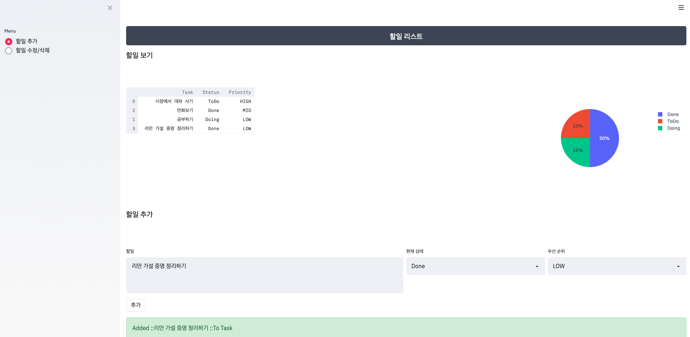

# streamlit-todo
todo list 관리를 위한 todo 웹페이지 입니다. 


## 바로 실행해 보기 🦊
[](https://ainize.web.app/redirect?git_repo=https://github.com/heewinkim/streamlit-todo)


## 빠른 설치 & 실행 - 도커 🐳
<details>
<summary>도커를 사용한 간편 설치&실행</summary>
<p>

```sh
# 도커는 설치 되어있어야합니다. 원하는 포트를 지정하여 백그라운드로 실행합니다.
docker run -d -p 80:80 heewinkim/todoapp 
```

접속은 http://localhost

</p>
</details>


## 직접 설치 & 실행 💻

<details>
<summary>소스로부터 직접 설치&실행</summary>
<p>

```sh
# 파이썬은 사전에 설치되어있어야합니다(3.6)

https://github.com/heewinkim/streamlit-todo.git
cd streamlit-todo
pip3 install -r requirements.txt
```

### 사용 방법 (Example)

streamlit run todo.py {DB_PATH} --server.port=80

DB_PATH (생략가능): 
- DB가 저장될 경로입니다. 디렉토리가 없다면 자동생성되며 .db 파일포맷으로 지정해야합니다.

- server.port 옵션으로 원하는 포트를 설정하세요

#### example
1. foreground 실행 

  streamlit run todo.py
  
2. background 실행

  nohup streamlit run todo.py 1>todo.log 2>&1 & 

Tips
서버를 백그라운드에서 유지되도록 하고 싶다면
nohup streamlit run todo.py 1>todo.log 2>&1 & 
와 같이 nohup을 이용하시면 편합니다.

</p>
</details> 





